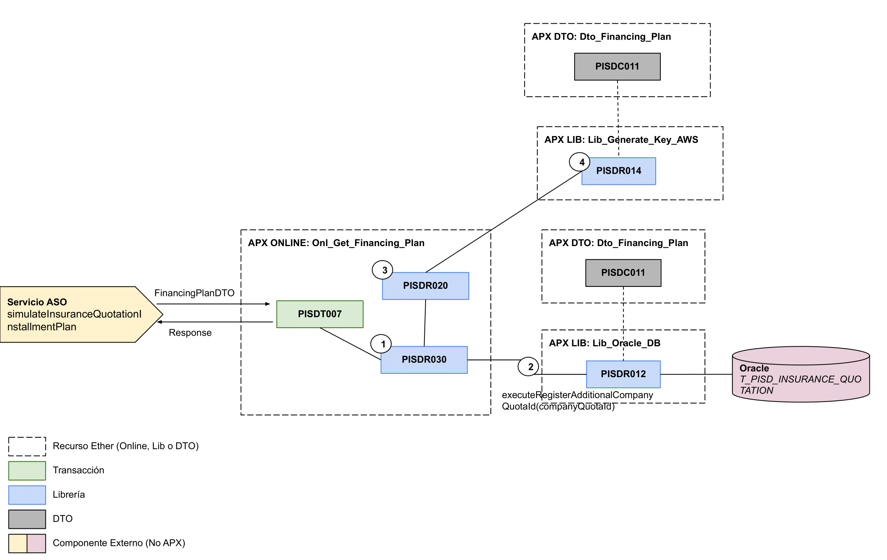

# 
# Recurso APX Online insuranceroyal-trx7

> El objetivo de este documento es proveer informacion relacionada de las transacciones online dentro de este recurso que ha sido implementado sobre la Arquitectura APX y desplegado a traves de la Consola Ether.

## 1. Transacciones:
> En este apartado se detallan todas las transacciones implementadas.

### 1.1. Transaccion PISDT007
  - Descripcion: Obtiene los planes de financiamiento para el servicio simulateInsuranceQuotationInstallmentPlan de Insurances
  - Tipo de Origen: Servicio de Negocio
  - API de Negocio: [vehicle-insurances](https://catalogs.platform.bbva.com/apicatalog/business/apis/apis-insurances-insurances/versions/global-1.23.0/resources/insurancesapiquotationsquotationidinstallmentsplanssimulatev1/)
  - SMC del Servicio ASO: [Documento](https://docs.google.com/spreadsheets/d/1-HfiN65vmcMU6GOtIbQv45XQH-hVpTYx4dg-bZBHOu0/edit#gid=1587295576)
  - Usuario Transaccional: ZG13001
  - Version: 01-PE
  - Respuestas:
    - Código de respuesta: Http Code: 200, Severity: OK
    - Código de Respuesta: Http Code: 400, Severity: ENR

## 2. DTOs:

> En este apartado se detallan todas las clases DTOs utilizadas en este recurso.

- **PISDC011**:
  - amazon:
    - **SignatureAWS**: Entidad SignatureAWS
  - bo:
    - **FinanciamientoPayloadBO**: 
    - financing:
      - **FinancingPlanBO**: Entidad FinancingPlan - Rimac
      - **CronogramaPagoBO**: Entidad CronogramaPago - Rimac
      - **FinanciamientoPayloadBO**: Entidad FinanciamientoPayload para payload a Rimac
  - utils:
    - **PISDErrors**: Entidad Errores
    - **PISDValidation**: Entidad Validación
    - **PISDProperties**: Entidad Propiedades
  - commons:
    - **PaymentPeriodDTO**: Entidad periodo de pago
    - **InstallmentsDTO**: Entidad pago
  - financing:
    - **FinancingPlanDTO**: Entidad plan de financiamiento
  - policy:
    - **PaymentAmountDTO**: Entidad pago de cuota
  - quotdetail:
    - **QuotDetailDAO**: Entidad QuotDetai para BD

## 3. Librerias:

### 3.1. Librerias Internas
> En este apartado se detallan todas las librerias internas creadas para implementar la logica de negocio de las transacciones.

#### 3.1.1. Libreria PISDR020
> EL uso de la Librería RBVDR020 está orientado a consumir el servicio de generación coronograma de pagos y
>  y el servicio calculo de cuotas, ambos de Rimac.

- **Método executeQuoteSchedule (FinancingPlanBO input, String traceId)**: Método para obtener el calendario de cuotas que genera Rimac
  - Avisos a retornar: PISD00120027
- **Método executePaymentSchedule(FinancingPlanBO input, String quotationId, String traceId)**: Método para obtener el cronograma de pago generado por Rimac
  - Avisos a retornar: PISD00120031

#### 3.1.2. Libreria PISDR030
> Orientada a realizar la lógica de negocio de la transacción PISDT007.

- **Método FinancingPlanDTO executeSimulateInsuranceQuotationInstallmentPlan (FinancingPlanDTO input)**: Método que ejecuta toda la lógica de negocio
  - Avisos a retornar: PISD00120028, PISD00120027, PISD00120031, PISD00120026 y PISD00120035

  ### 3.2. Librerias Externas
> En este apartado se detallan las librebrias externas que hace uso esta aplicacion para acceder a fuentes de terceros.

- **Libreria PISDR012**: [Ver documentaction](https://globaldevtools.bbva.com/bitbucket/projects/PE_PISD_APP-ID-26197_DSG/repos/insuranceroyal-lib12/browse/doc/PISD_APX_Library_PISDR012.md?at=refs%2Fheads%2Frelease%2F0.21)
  - Metodos reutilizados: executeRegisterAdditionalCompanyQuotaId().
- **Libreria PISDR014**: [Ver documentaction](https://globaldevtools.bbva.com/bitbucket/projects/PE_PISD_APP-ID-26197_DSG/repos/insuranceroyal-lib14/browse/doc/PISD-insuranceroyal-lib14.md?at=refs%2Fheads%2Frelease%2F0.10)
  -  Metodos reutilizados: executeSignatureConstruction().

  ## 4. Mensajes de Error y Avisos:
> En este apartado se detallan los distintos mensajes de error que retornan las librerias de acuerdo a los casos y logica de negocio implementada.

- **Advise PISD00120026**: NO SE ENCONTRÓ NINGÚN RESULTADO EN LA BD 
- **Advise PISD00120027**: ERROR AL CONSUMIR EL SERVICIO DE CÁLCULO DE CUOTA DE RIMAC
- **Advise PISD00120028**: NO SE PUEDE OBTENER PLAN DE FINANCIAMIENTO - FECHA DE INICIO DE CRONOGRAMA MENOR A LA 
- **Advise PISD00120031**: ERROR AL CONSUMIR EL SERVICIO DE CRONOGRAMA DE PAGO DE RIMAC
- **Advise PISD00120035**: ERROR EN PETICIÓN DE FINANCIAMIENTO - CAMPO PERIODO CON VALOR INVÁLIDO

## 5. Diagrama de Componentes:
> En este apartado se grafican todos los componentes involucrados en el funcionamiento del recurso.

## 6. Versiones del Componente:
> En este apartado se detalla un historial de cambios o *changelog* por cada version implementada del recurso.

- **Versión 0.5.1**: Esta versión le permite obtener los datos de financiamiento a partir de servicios de Rimac.
- **Versión 0.5.3**: Se efectúa un ajuste para devolver como salida de la Api el dato PrimaBruta del servicio Rimac generarCronogramaPago.
- **Versión 0.5.4**: Esta versión permite manejar una bifurcación a la hora de consumir servicios de Rimac, lo que permitirá manejar uri's diferentes según el tipo de producto especificado.